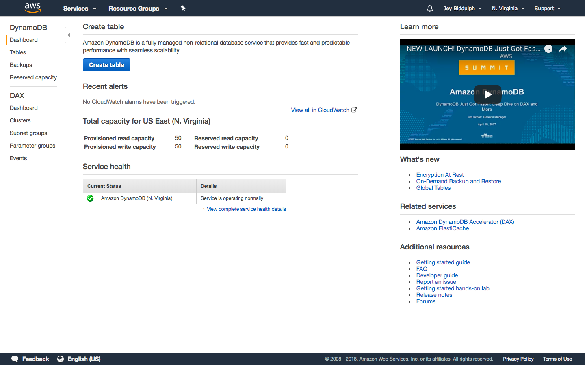
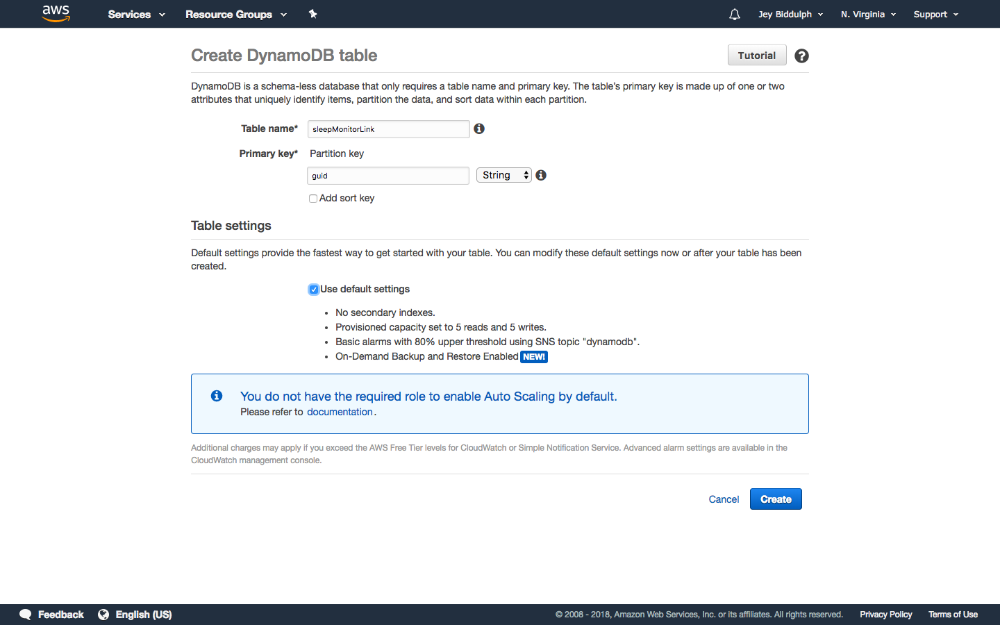
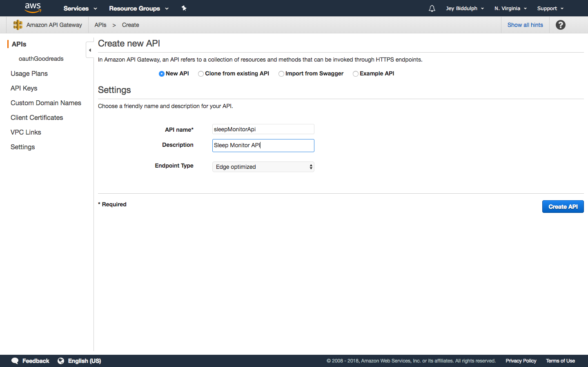
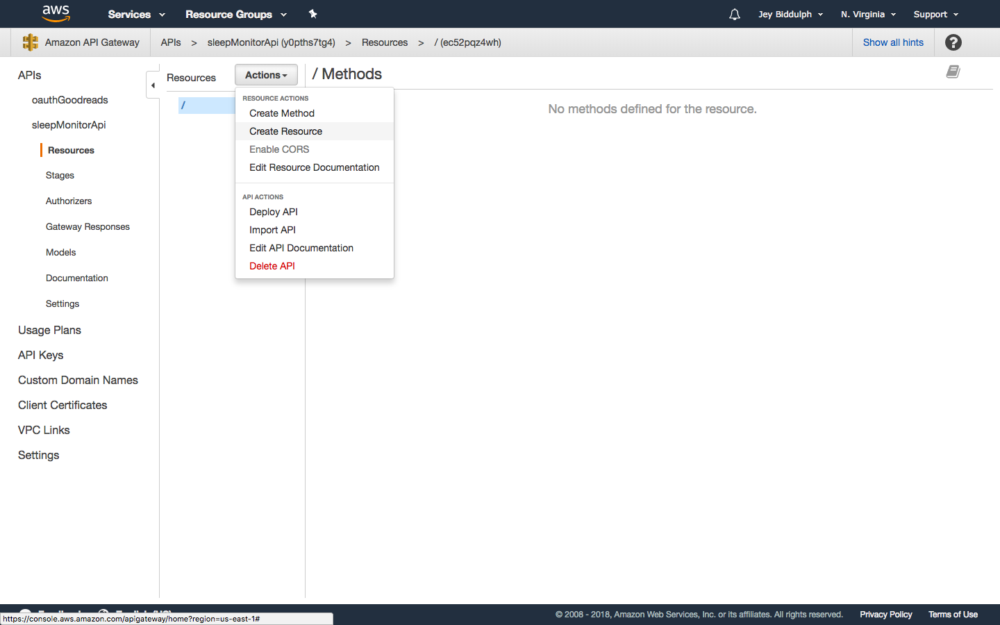
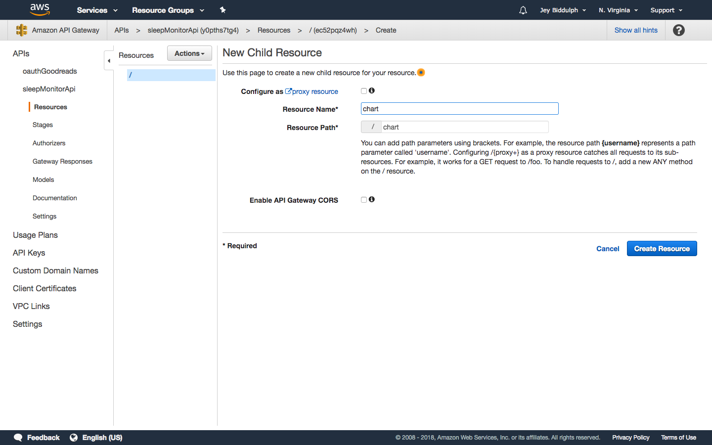
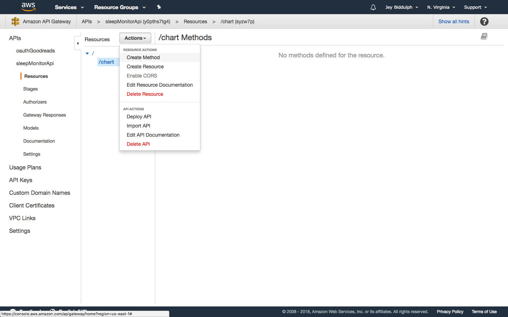
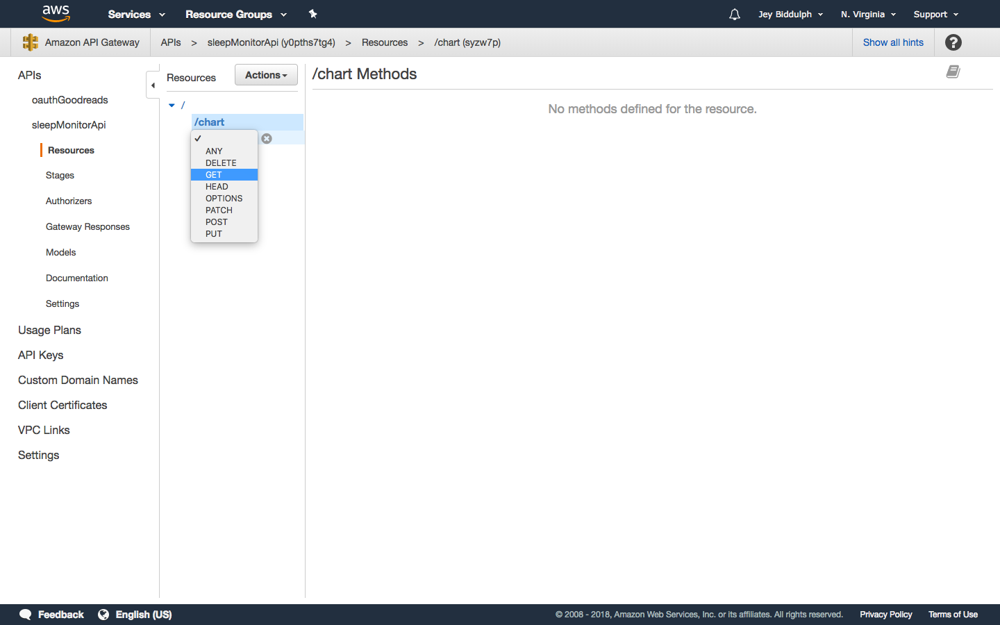
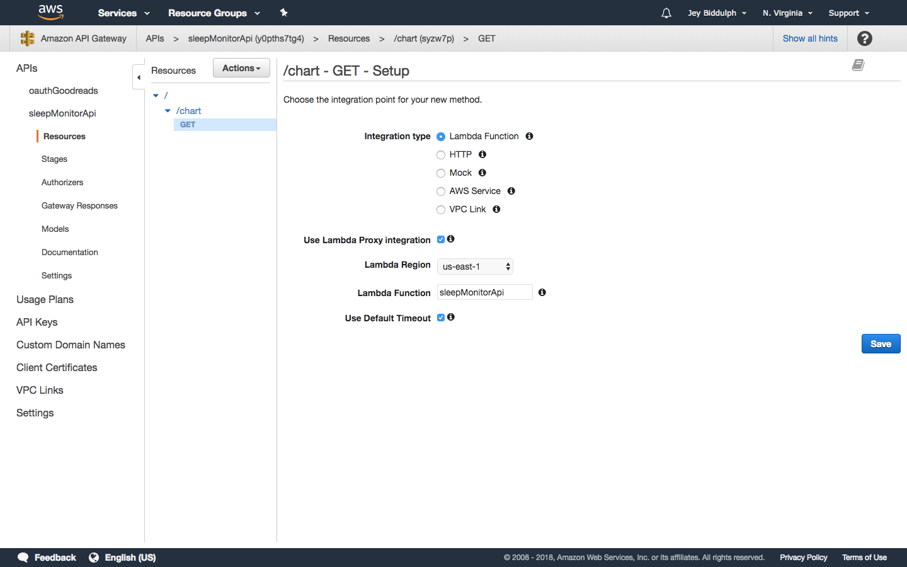
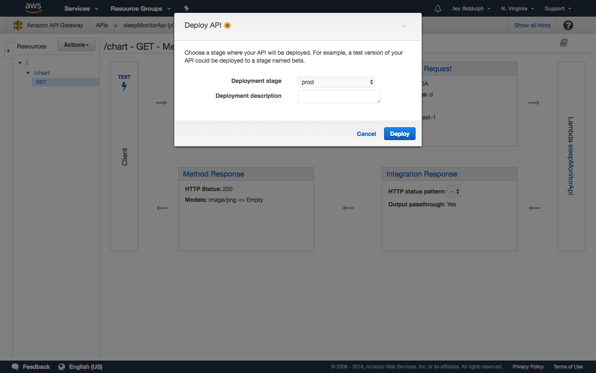
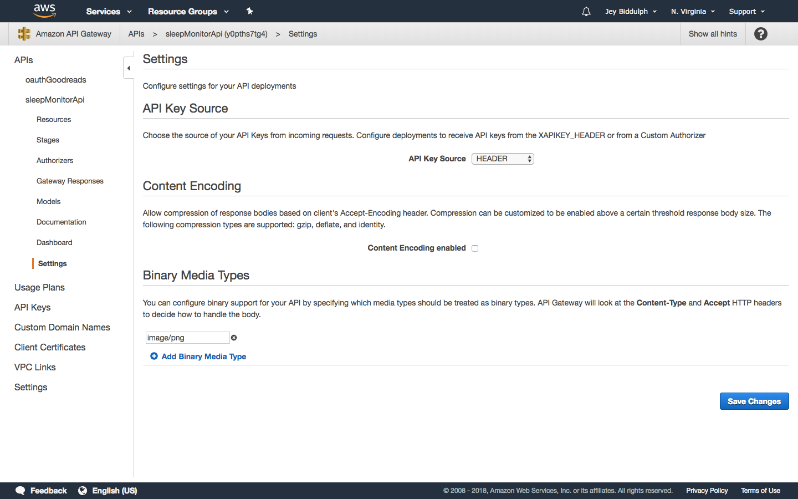

# Good Sleep 

## DynamoDB Setup

Head to the [DynamoDB dashboard](https://console.aws.amazon.com/dynamodb/home?region=us-east-1) to set up the link table in the "us-east-1" region, and press _Create Table_.

Name your table *sleepMonitorLink*, and add the primary key *guid* with the type "string".

You're done with DynamoDB. Our other table which stores Alexa session data will be created automatically by the skill.

## API Gateway Setup

Now go to the [API Gateway dashboard](https://console.aws.amazon.com/apigateway/home?region=us-east-1#/apis) and hit _Create API_.

Create a *New API* and name it *sleepMonitorApi*.

Create a resource with the path */chart*.

Then create a *GET* method on the chart resource.

Choose *Lambda function* as the integration type, tick _Use Lambda proxy integration_, select the region *us-east-1*. At this point you'll need to [create your Lambda functions using the setup guide](http://github.com/jeybee/goodsleep/blob/master/Setup_Lambda.md) before you can continue.

Repeat the steps above to add a resource with the path */guid*. Make sure to tick Lambda proxy integration and enter the same Lambda function name, as for the chart service.

Then you are ready to deploy your API. Choose _Deploy API_ from the Actions menu, and hit _Deploy_.

You'll be given an AWS link to your deployed API Gateway service. 

Your API for the link service and chart service are now set up. They're both pointing to the same Lambda function and will automatically pass through request details like the query string or any POSTed parameters.

There's one more step to allow the API Gateway to return our chart images as binary data to load as an image properly. Go in to Settings for your new API and add *image/png* under _Binary Media Types_.

