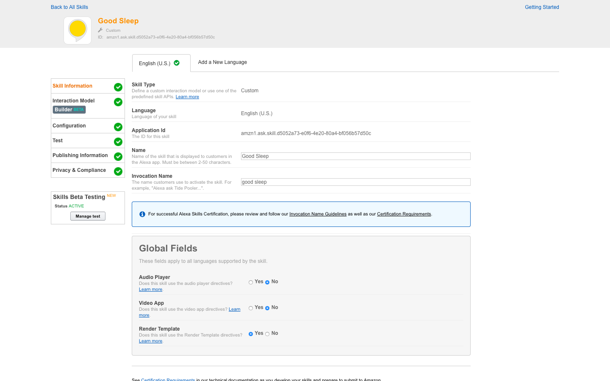
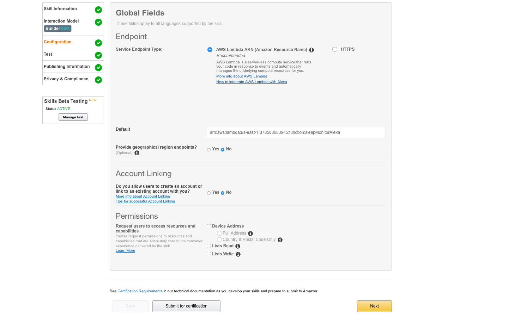
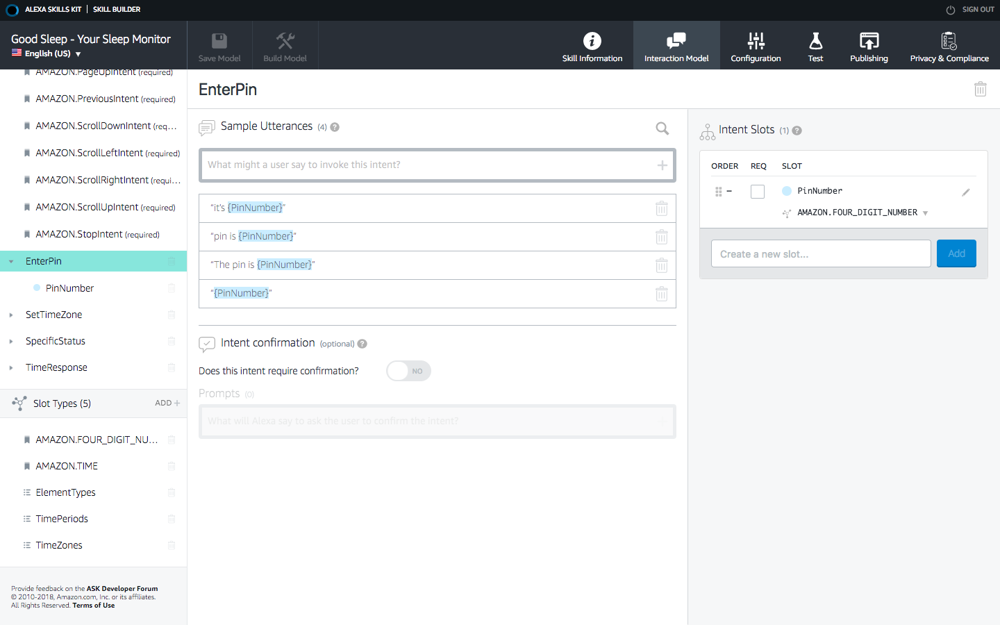
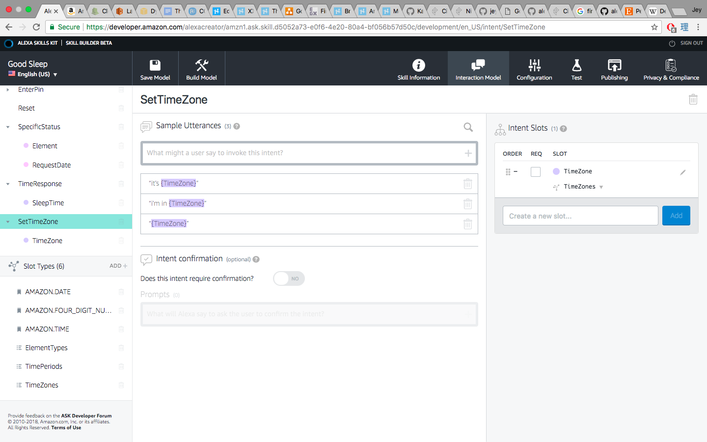
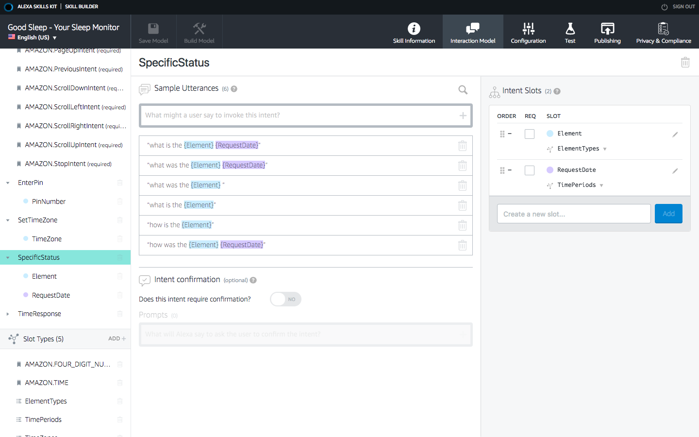
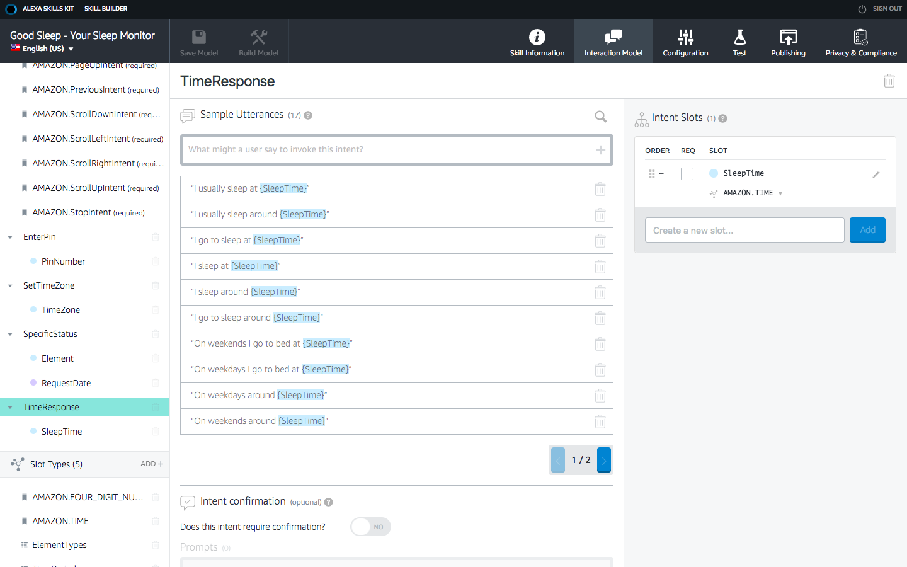
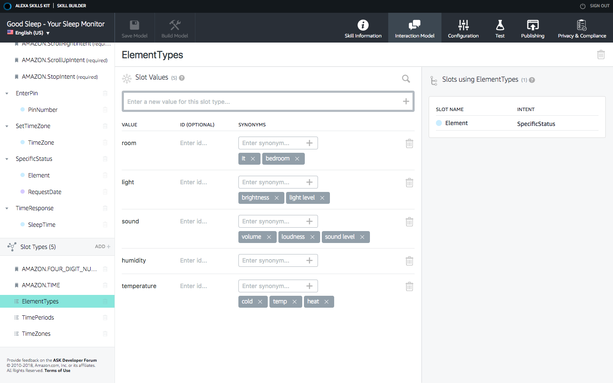
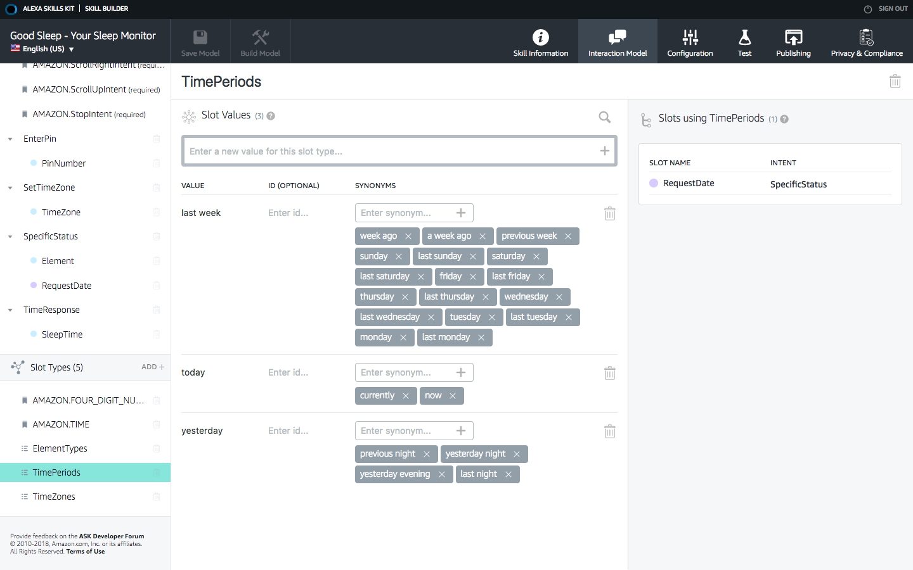
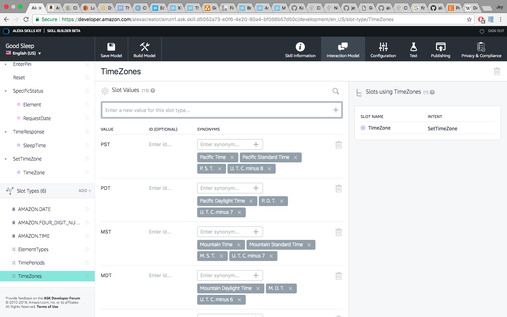

# Good Sleep 

## Alexa Skill Setup

To set up your Alexa Skill, head over to the [dashboard](https://developer.amazon.com/edw/home.html#/) and click Get Started under Alexa Skills Kit. Then click Add a New Skill.

Fill out the skill information, adding the name and invocation "good sleep", and then check Yes for Render templates (which lets you display information on Echo devices with screens).

Then click through to configuration and choose AWS Lambda ARN. You'll need to copy in the ARN for the sleepMonitorAlexa Lambda function [we created](http://github.com/jeybee/goodsleep/blob/master/Setup_Lambda.md)

Now we'll jump in to the Interaction Builder under Interaction Model to set up the intents and dialogue options.

The configuration for the skill is [included in the repo](http://github.com/jeybee/goodsleep/blob/master/Alexa_Skill_Config.json). You can click Code Editor in the Interaction Builder and drop the JSON file in there to automatically configure it.

There will already be a load of standard intents added, and you'll need to set up our custom ones:

* SpecificStatus - the intent which requests summaries and charts about the room
* EnterPin - the intent for entering your device PIN number
* SetTimeZone - the intent for saying your timezone
* TimeResponse - the intent for replying with a time

We use built-in slot types for parsing the PIN number and times. We also need to add custom slot types for:

* ElementTypes - the whole room, or specific request like temperature, humidity etc.
* TimePeriods - today/now, yesterday, last week
* TimeZones - PST/Mountain Time etc. - only GMT and US timezones are supported currently

You can see screenshots of all these intents and data types below:

### Intents

### Slot Types

