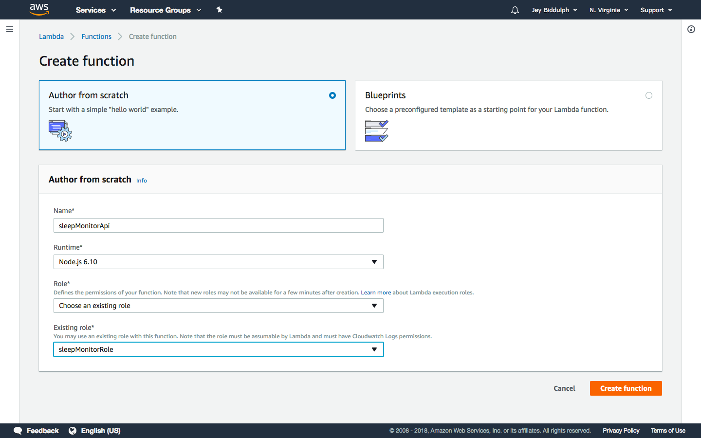
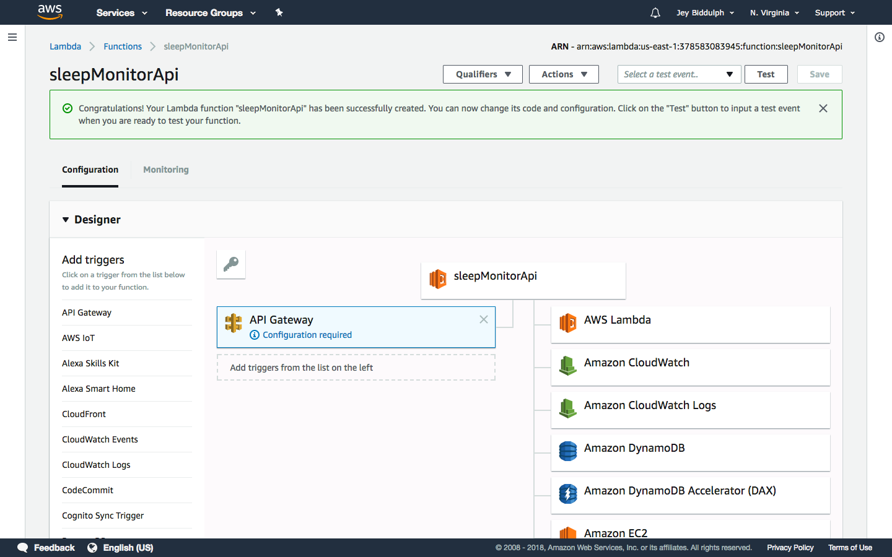
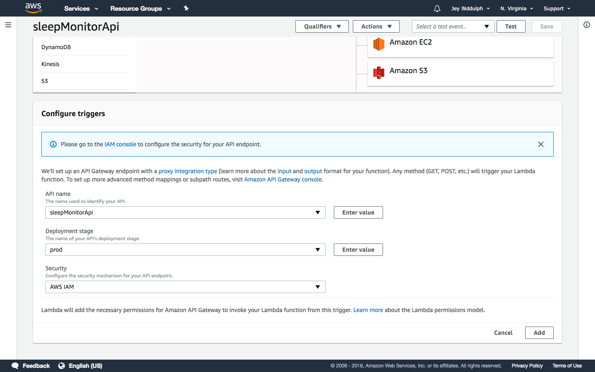
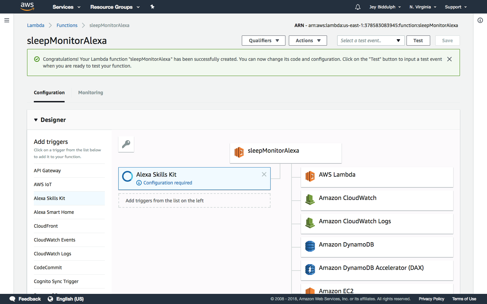

# Good Sleep 

## Lambda Setup

Go to the [Lambda dashboard](https://console.aws.amazon.com/lambda/home?region=us-east-1#/functions) to set up the our Lambda functions for the link/chart API service and for the Alexa skill. Make sure to create your functions in the "us-east-1" region. Press _Create Function_.

Name your function *sleepMonitorApi*, using Node.js 6.10. You'll need a role set up which has the ability to execute Lambda functions and read/write to DynamoDB. You can set that up at [AWS Identity Management](https://console.aws.amazon.com/iam/home?region=us-east-1).

Then add the *API Gateway* trigger to your function, so it can be called from the API services we [set up here](http://github.com/jeybee/goodsleep/blob/master/Setup_APIGateway.md).

Enter the API Gateway name *sleepMonitorApi* that we have already set up, and select prod as the deployment stage.

Then hit Save.

Now, under the Function code section, upload a zip of the code in the API folder.

--

Now repeat these steps to add a second function called *sleepMonitorAlexa*. Instead of the API Gateway trigger, add the *Alexa Skills Kit* trigger. You'll need to configure it by adding your Alexa skill ID, which we set up [here](http://github.com/jeybee/goodsleep/blob/master/Setup_Alexa.md). Then hit Save.

Now, under the Function code section, upload a zip of the code in the Alexa folder.
